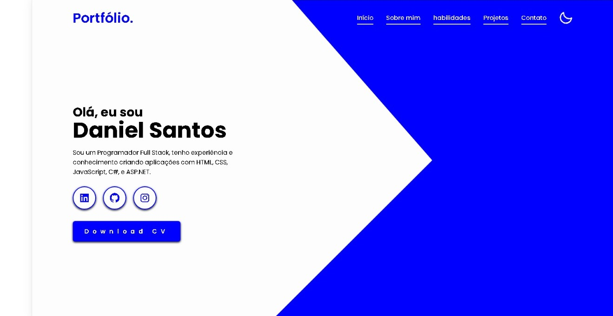

#  
 <a href="https://lapiedradaniel.github.io/Portifolio/#home" target="_blank"> Portfólio de Desenvolvedor <a/>

 
 
 

  <h2 align="center" >Este é um portfólio desenvolvido para compartilhar meus projetos e aprendizados.</h3>
 

<h1>
         
</h1>

